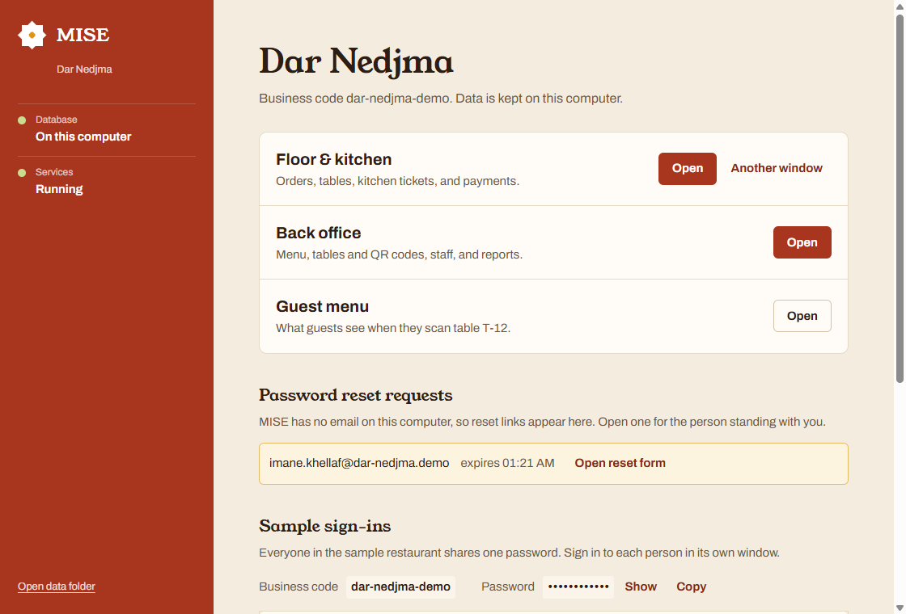
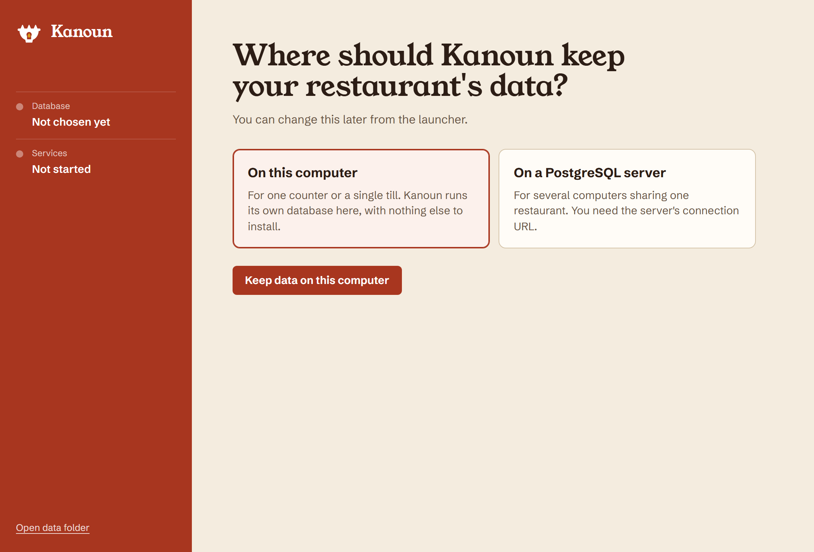
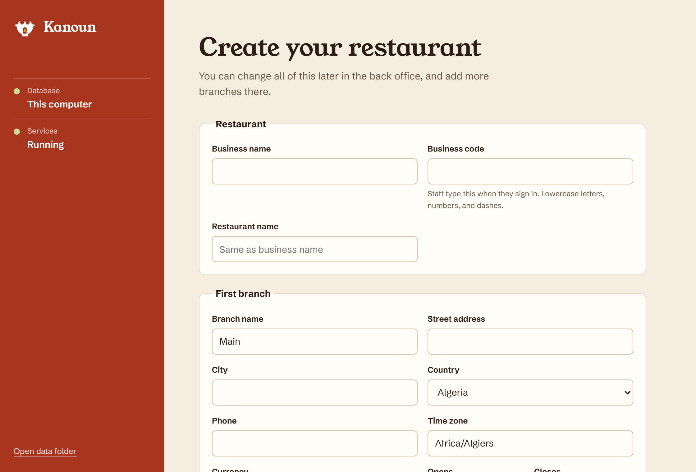
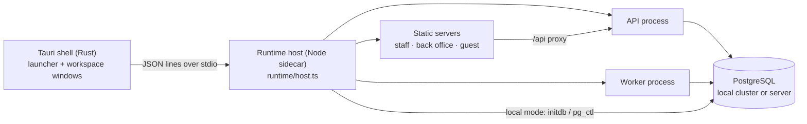
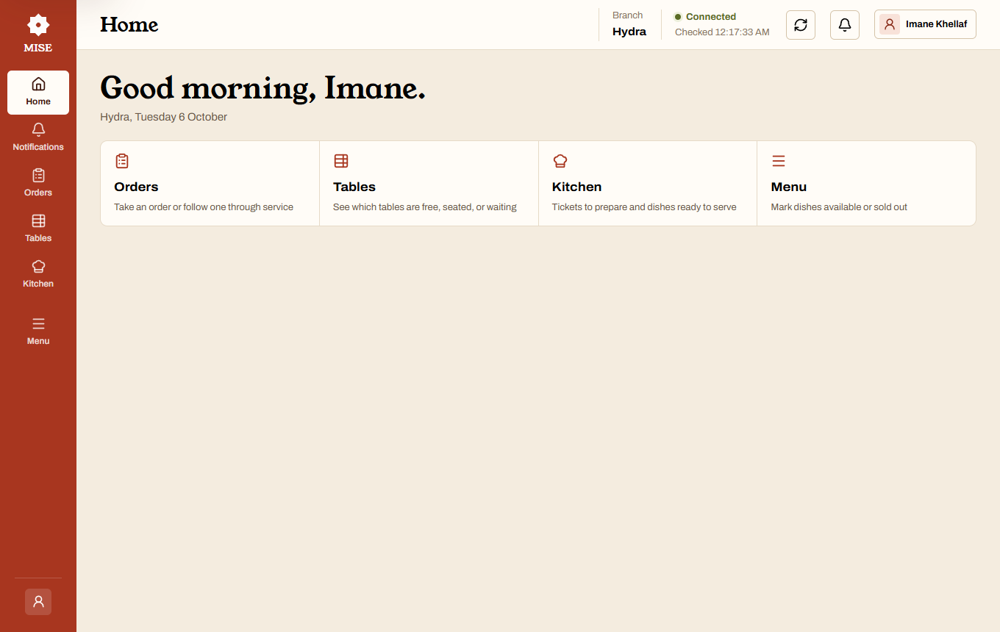
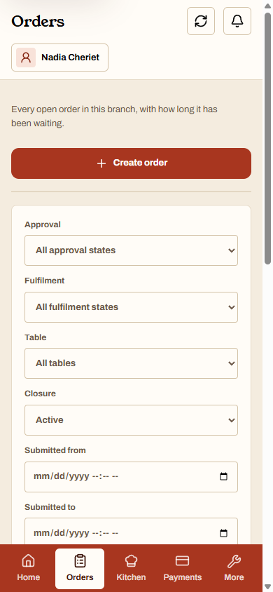
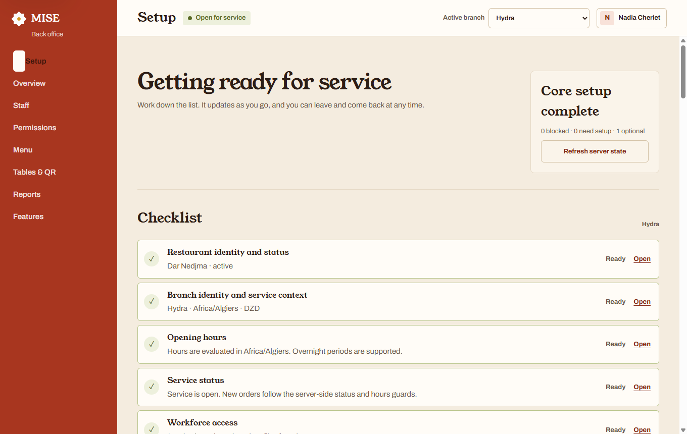
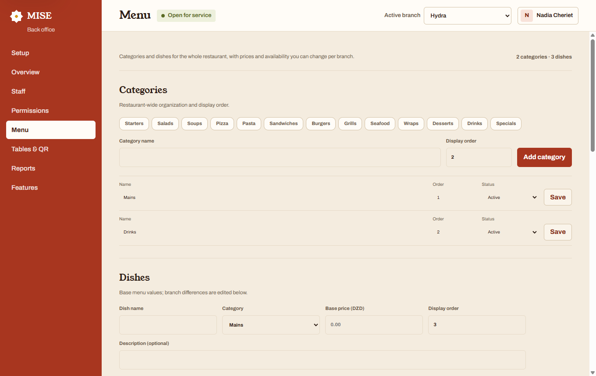
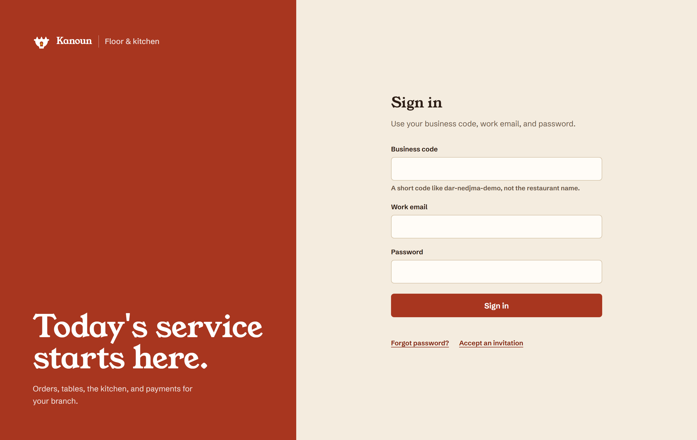
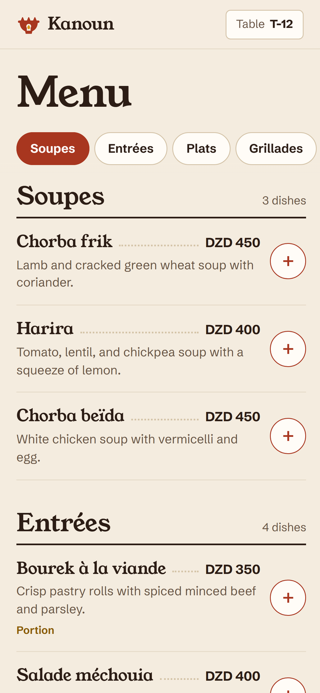

# MISE

**Restaurant operations for the dining room, the kitchen, and the back office.**
Guests order from a QR code at their table, the kitchen works from live
tickets, floor staff and cashiers settle bills, and owners run the menu,
tables, team, and reports. MISE installs as a Windows desktop app that keeps
its data either on that computer or on a PostgreSQL server.

<p align="center">
  
</p>

> [!NOTE]
> MISE is a working product name. Every restaurant, person, order, and
> payment shown here is synthetic.

## Contents

- [The desktop app](#the-desktop-app)
- [A tour](#a-tour)
- [What it does](#what-it-does)
- [Architecture](#architecture)
- [Developing](#developing)
- [Verification](#verification)
- [Documentation authority](#documentation-authority)

## The desktop app

MISE Desktop is a [Tauri](https://tauri.app) app (`apps/desktop`). Its window
is a small launcher; the staff, back-office, and guest apps open in their own
windows, each with its own sign-in, so a cashier and a cook can work side by
side on one computer.

On first start it asks where the restaurant's data should live:

| Choice                     | What happens                                                                                                                                                                                            |
| -------------------------- | ------------------------------------------------------------------------------------------------------------------------------------------------------------------------------------------------------- |
| **On this computer**       | MISE runs its own PostgreSQL 18 from the install folder and keeps the data in `%APPDATA%\app.mise.desktop`. Nothing else to install.                                                                    |
| **On a PostgreSQL server** | Enter a connection URL such as `postgresql://mise:…@192.168.1.20:5432/mise`. MISE tests it, creates its tables, and several computers can share one restaurant. The database itself must already exist. |

Then it offers to **create your restaurant** (business, first branch, and owner
account) or to **load the sample restaurant**, Dar Nedjma in Algiers, with a
two branches, a 32-dish menu with options, a team of thirteen, ten days of
orders (paid, refunded, and cancelled), and a service in progress. The sample
can also be added later beside your own restaurant without touching it.

<p align="center">
  
  
</p>

Because a desktop install has no email service, password-reset links appear in
the launcher for whoever is at the counter. Closing the launcher stops the
services and the local database cleanly.

### How it is put together



- The Rust shell stays thin: it supervises one Node sidecar, relays a
  validated line protocol (`runtime/protocol.ts`), and opens windows.
- The runtime host starts PostgreSQL (local mode), applies the versioned
  migrations, forks the API and worker as separate processes, and serves the
  three built web apps with an `/api` proxy. Shutdown always travels over
  stdin and IPC, never as a kill, so PostgreSQL is stopped properly on
  Windows.
- The API, worker, and seeder are bundled into single files with esbuild, so
  the install folder is relocatable. Only `argon2` ships as a native module.
- Workspace ports are fixed per install (preferring `47300`–`47305`) because
  printed table QR codes contain the guest address.

See [`apps/desktop/README.md`](apps/desktop/README.md) for building the
installer and [ADR-0008](docs/architecture/adr/ADR-0008-tauri-desktop-shell.md)
for why it replaced Electron.

## A tour

**Floor and kitchen.** Staff see only what their role allows. Home greets them
with shortcuts to their work; Orders lists everything open with how long it
has waited; the Kitchen groups tickets until a whole order is ready.

<p align="center">
  
  
</p>
<p align="center">
  
  
</p>

**Back office.** Owners work down a setup checklist, then maintain the menu
(with per-branch prices and availability), tables and QR codes, the team and
their permissions, features, and reports.

<p align="center">
  
  
</p>

**Guests.** A table QR code opens the menu for that table. Guests add dishes
with notes, send the order, follow its progress, and ask for the bill.

<p align="center">
  
  
</p>

## What it does

| Area                     | Included                                                                                                                     |
| ------------------------ | ---------------------------------------------------------------------------------------------------------------------------- |
| Restaurants and branches | Several restaurants per business, branch time zones, overnight hours, dated closures, open/paused/closed service             |
| People and access        | Owner account, staff invitations and password recovery, permissions per branch, role templates, sessions that can be revoked |
| Menu and tables          | Categories, dishes, options, per-branch overrides, tables with live state, QR codes that can be replaced or revoked          |
| Ordering                 | Guest and staff ordering, prices recalculated on the server, safe retries, cancellation and bill requests                    |
| Kitchen and service      | Grouped tickets, notes and options, queued → preparing → ready, reconnect recovery, serving whole orders                     |
| Payments                 | Cash and card recording, refunds and corrections that are never edited, moving a whole table, guarded completion             |
| Insight                  | In-app notifications, branch dashboard, sales by currency, audit history                                                     |

Deliberately out of scope for the MVP: online card processing, split bills,
stock control, printed kitchen tickets, customer accounts, external
notification providers, report export, currency conversion, and offline order
replay. The release boundary is authoritative in
[the MVP scope](docs/product/mvp-scope.yaml).

## Architecture

A modular monolith on PostgreSQL. The API and worker are separate processes;
the guest, staff, and back-office apps are independent React applications.

```text
apps/
  api/              Express composition root and HTTP adapters
  worker/           Outbox delivery and projections
  web/customer/     Guest QR ordering (mobile first)
  web/staff/        Floor, kitchen, and payments
  web/admin/        Back office
  web/design-system.css   Shared tokens: palette, type, shell, sign-in
  desktop/          Tauri shell, launcher UI, and the Node runtime host
packages/
  building-blocks/  Database pool, migrations, outbox, observability, security
  contracts/        Shared transport schemas
  modules/          Domain modules and their adapters
  service-workflow/ Cross-module transactions
migrations/         Versioned SQL migrations
docs/               Product, domain, architecture, contract, and quality authorities
```

Guarantees that every change keeps:

- Express appears only in HTTP adapters; every external input is validated
  with Zod.
- Each module owns its writes; aggregate changes and their outbox events
  commit in one transaction.
- Payments, refunds, corrections, and audit records are append-only.
- Tenant and branch scope comes from a validated session, never from a raw
  identifier.
- Prices and totals are recalculated on the server; timestamps are stored in
  UTC and shown in the branch's time zone.

Read the [module map](docs/architecture/modules.yaml) and
[ADR index](docs/architecture/adr/README.md) before changing a boundary, and
[DESIGN.md](DESIGN.md) before changing the interface.

## Developing

Pinned toolchain: Node.js `24.18.0`, pnpm `11.17.0` (via Corepack),
PostgreSQL `18.1`. The desktop app also needs Rust (stable) and the Visual
Studio C++ build tools.

```powershell
fnm use 24.18.0
corepack pnpm install --frozen-lockfile
Copy-Item .env.example .env
docker compose up -d postgres
corepack pnpm db:migrate
corepack pnpm dev            # API, worker, and staff app
corepack pnpm dev:desktop    # the Tauri app against a local runtime build
corepack pnpm build:desktop  # the Windows installer
```

Focused processes: `dev:api`, `dev:worker`, `dev:staff`,
`--filter @rms/customer-web dev`, `--filter @rms/admin-web dev`. For a
browser-based demo with seeded data and a role launcher, use
`corepack pnpm dev:demo` (see [local demo](docs/operations/local-demo.md)).

## Verification

| Goal                                  | Command                                         |
| ------------------------------------- | ----------------------------------------------- |
| Format                                | `corepack pnpm format:check`                    |
| Lint                                  | `corepack pnpm lint`                            |
| Strict types                          | `corepack pnpm typecheck`                       |
| Unit and PostgreSQL integration tests | `corepack pnpm test`                            |
| Module-boundary checks                | `corepack pnpm test:architecture`               |
| OpenAPI and event validation          | `corepack pnpm contracts:lint`                  |
| Production builds                     | `corepack pnpm build`                           |
| Everything above                      | `corepack pnpm check`                           |
| Production dependency audit           | `corepack pnpm audit --prod --audit-level high` |

Set `TEST_DATABASE_URL` to run the PostgreSQL integration tests locally; CI
supplies it so they never skip there. Browser-automation suites were retired
in favour of these faster checks; interface changes are reviewed visually
against [DESIGN.md](DESIGN.md).

## Documentation authority

| Question                                | Source of truth                                                                             |
| --------------------------------------- | ------------------------------------------------------------------------------------------- |
| What should the product do?             | [Requirements](restaurant-management-system-requirements.md)                                |
| Is it in the MVP and ready?             | [MVP scope](docs/product/mvp-scope.yaml)                                                    |
| Which product decision applies?         | [Decision register](docs/product/decision-register.md)                                      |
| What states and guards are canonical?   | [Workflows](docs/domain/workflows.yaml) and [business rules](docs/domain/business-rules.md) |
| Which feature or permission key exists? | [Features](docs/config/features.yaml) and [permissions](docs/security/permissions.yaml)     |
| Which module owns the data?             | [Modules](docs/architecture/modules.yaml)                                                   |
| What is the HTTP or event shape?        | [OpenAPI](docs/contracts/openapi.yaml) and [events](docs/contracts/events.yaml)             |
| How should it look and read?            | [DESIGN.md](DESIGN.md)                                                                      |
| Where is every authority indexed?       | [Documentation index](docs/index.md)                                                        |

Contributors start with [AGENTS.md](AGENTS.md).
