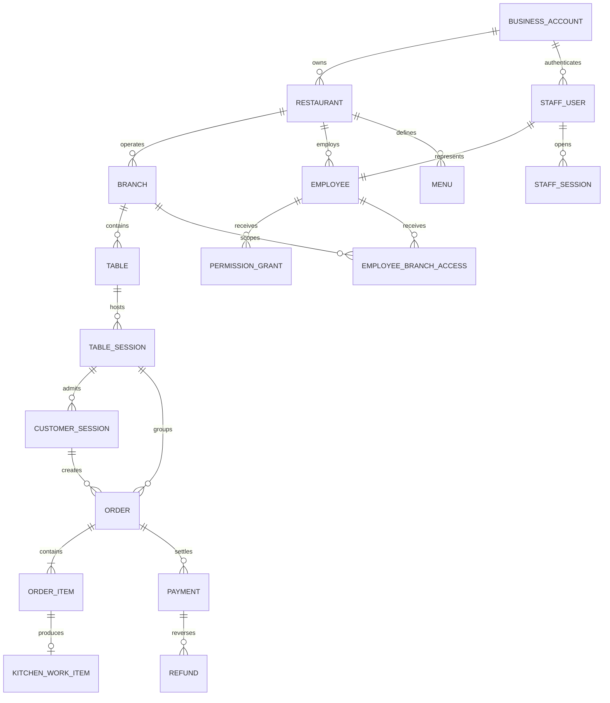

# Domain Model

## Ownership hierarchy

`BusinessAccount` is the tenant. `Restaurant` and `Branch` are authorization and configuration scopes inside the tenant.

## Aggregates

### BusinessAccount

Owns tenant identity, active state, restaurants, and business-level administrators. Deactivation blocks new operational work but never deletes history.

### RestaurantConfiguration

Owns:

- Restaurant profile and default settings.
- Branch profiles and operating hours.
- Employee profiles and branch employment.
- Feature/configuration versions.

Identity credentials are references, not part of the employee profile.

### IdentityAccess

Owns staff users, password credentials, revocable server-side sessions,
single-use invitation and recovery-token records, and grants-only permission
assignments. A staff user references exactly one tenant-owned employee profile.
Only keyed hashes of opaque session, CSRF, invitation, and recovery tokens are
persisted. Credential resets and employee deactivation revoke affected sessions
in the same `ServiceWorkflow` transaction as the authoritative change.

### Menu

Owns categories, dishes, option groups, options, prices, and branch overrides. A submitted order never points to mutable menu values for historical display; it stores a snapshot.

### Table

Owns the physical table identity and active/deactivated state. Operational availability is derived from its active `TableSession` and restrictions, not assigned arbitrarily.

### TableSession

Represents one dining party's occupancy of one table. It:

- Opens when the first order is successfully submitted.
- May contain several guest sessions and orders.
- May be moved as a whole by authorized staff.
- Closes only when all orders are terminal and no operational request remains.
- Is the source for table availability and future cleaning work.

### CustomerSession

Represents temporary guest authorization. It belongs to one tenant, restaurant, branch, and table session or pending table claim. It may read only its own orders. Tokens are never stored in plaintext.

### Order

The primary financial and fulfilment aggregate. It owns:

- Branch-local order reference.
- Customer-session and table-session references.
- Immutable submitted item snapshots.
- Server-calculated total.
- Authoritative approval and closure state.
- Read projections of Kitchen-owned fulfilment and Payments-owned financial state for customer/staff presentation.
- Configuration version.
- Cancellation/correction history.
- Bill-request history.

An order contains at least one item and uses one currency.

### KitchenWorkItem

Owned by Kitchen. It references one order item and owns preparation state and timestamps. Ordering receives fulfilment projections/events; it does not independently mutate kitchen preparation state.

### Payment

An append-only record of money recorded against one order. A correction does not update the original row; it creates a reversal or refund record. The outstanding balance is derived from the order total and applied payment ledger.

### Notification

A durable user inbox item produced from an operational event. It is not the source of truth for the underlying task.

### BillRequest

Owned by Ordering and associated with one order. At most one open bill request exists per order. It resolves when payment is recorded, the order is cancelled, or authorized staff explicitly resolve it.

### AuditEvent

An append-only security/operational record containing actor, effective employee if different, action, target, tenant/branch, time, reason, correlation, and redacted before/after data.

## Important cardinalities

- One business account has one or more restaurants.
- One restaurant has one or more branches.
- A menu belongs to one restaurant; a branch override cannot change menu ownership.
- A table belongs to exactly one branch.
- A table has at most one open table session.
- A customer session belongs to exactly one branch and at most one open table session.
- An order belongs to exactly one branch, table session, and creating customer/staff session.
- A payment applies to exactly one order in the MVP.
- A kitchen work item references exactly one order item.

## Value objects

- `Money(amount, currency)`: fixed precision; currencies must match for arithmetic.
- `Quantity(value)`: positive integer for order items.
- `OrderReference`: unique within tenant and branch.
- `PermissionKey`: value from `docs/security/permissions.yaml`.
- `ConfigurationVersion`: immutable reference stored by active workflow records.
- `BranchBusinessDate`: date calculated in the branch's IANA time zone.
- `IdempotencyKey`: tenant-, actor-, and operation-scoped key with request hash.

## Historical snapshots

Every submitted `OrderItem` stores:

- Dish and option display names.
- Unit and option prices.
- Quantity.
- Currency.
- Tax-inclusive treatment.
- Customer note.
- Menu version and source identifiers for traceability.

Later menu edits or deactivation never rewrite this snapshot.
