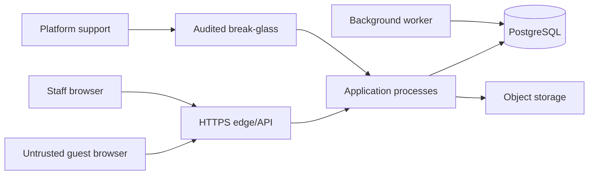

# Security and Threat Model

## Assets

- Tenant operational and financial records.
- Staff credentials, sessions, and permission grants.
- Guest-session authorization.
- QR identifiers and table association.
- Payment records and audit history.
- Configuration, exports, backups, and secrets.

## Trust boundaries

## Threats and mandatory controls

| ID | Threat | Controls |
|---|---|---|
| THR-001 | Cross-tenant identifier substitution | Derive tenant from validated session; composite tenant constraints; scoped repositories; negative API/database tests; return not-found for inaccessible resources. |
| THR-002 | Guessing or sharing a table QR | Cryptographically random opaque identifiers, hash at rest, rotation/revocation, rate limits, branch/table binding, exchange for short-lived guest session. |
| THR-003 | Order/assistance spam | Rate limit by QR, session, tenant, and network signals; idempotency; anomaly metrics; branch kill switch. |
| THR-004 | Guest reads another guest's order | Bind order to guest session; authorize every query; never expose sequential identifiers. |
| THR-005 | Privilege escalation through permission management | Grants-only model, delegable-subset rule, last-admin protection, reauthentication for critical changes, transactional audit. |
| THR-006 | Stale permission or revoked session remains active | Immediate session/cache invalidation; short validation window; terminate real-time stream. |
| THR-007 | CSRF or session theft | Secure HTTP-only same-site cookies, TLS, anti-CSRF, origin validation, session rotation, no tokens in URLs or logs. |
| THR-008 | XSS through names, menu text, or notes | Contextual output encoding, input length limits, sanitization where rich text exists, Content Security Policy. |
| THR-009 | Price or currency manipulation | Ignore client totals; server snapshot resolution; one order currency; immutable financial ledger. |
| THR-010 | Duplicate order/payment through retries | Scoped idempotency record with payload hash and replayed response. |
| THR-011 | Unauthorized support access | Deny by default; approved reason; least privilege; expiry; visible audit; periodic review. |
| THR-012 | Sensitive data in logs/exports | Structured redaction, data classification, signed expiring downloads, authorization recheck, CSV-injection protection. |
| THR-013 | Outbox payload leakage | Minimum payload, tenant context, encrypted transport/storage, retention cleanup, restricted worker access. |
| THR-014 | Backup exposure | Encryption, restricted restore access, tenant-safe recovery process, restore audit, key rotation. |

## Security verification gates

- Threat-model review for new public endpoints or external integrations.
- Tenant isolation tests for every resource and real-time channel.
- Authorization tests for every protected operation.
- Dependency and secret scanning in CI after bootstrap.
- Static analysis, input-validation tests, CSRF/XSS tests, and rate-limit tests.
- Restore and support-access exercises before production.

