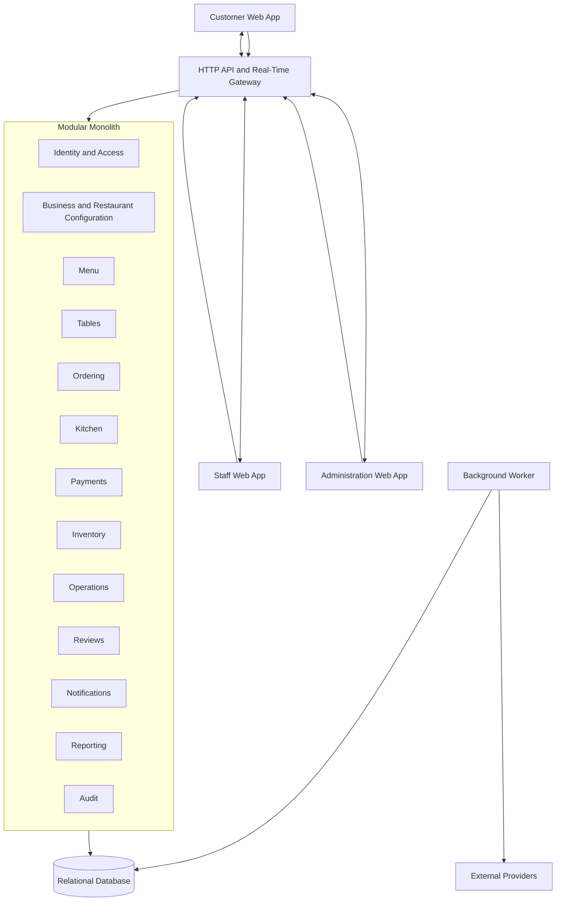
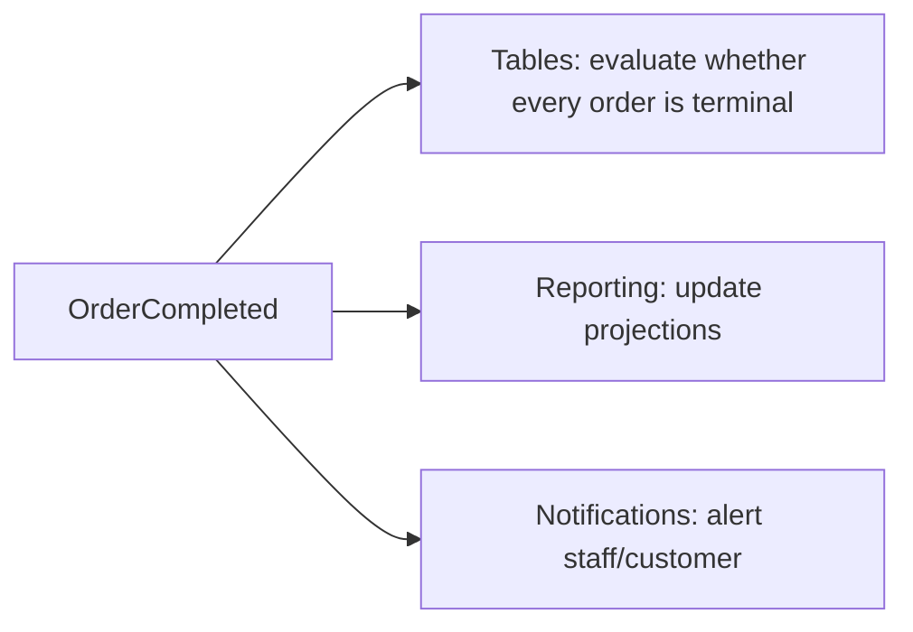
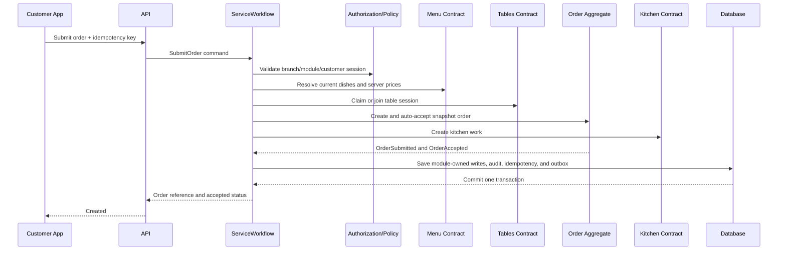
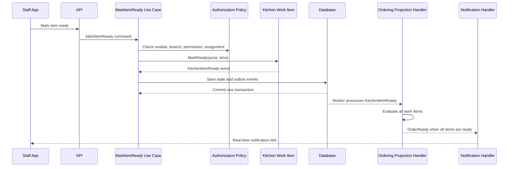

# Restaurant Management System

## Architecture Baseline

**Document status:** Approved architecture baseline  
**Version:** 0.2  
**Related document:** `restaurant-management-system-requirements.md`  
**Architecture:** Modular monolith with layered module internals  
**Module catalogue:** `docs/architecture/modules.yaml`  
**Consistency model:** `docs/architecture/consistency.md`  
**Express implementation:** `docs/architecture/express-implementation-guide.md`  
**ADR index:** `docs/architecture/adr/README.md`

---

## 1. Purpose

This document describes the proposed software architecture for the Restaurant Management System. It translates the product requirements into technical boundaries, dependency rules, communication patterns, and implementation guidance.

The architecture is intended to:

- Keep the initial system practical to build and deploy.
- Preserve strong business and tenant boundaries.
- Support simple and complex restaurant workflows.
- Allow modules to evolve independently.
- Avoid premature distributed-system complexity.
- Provide a reasonable path for future extraction of selected services.

---

## 2. Architecture Decision

The recommended architecture is:

```text
Modular Monolith
+ Node.js active LTS, Express 5, and strict TypeScript
+ Business-oriented modules
+ Layered internals
+ Explicit domain models and state transitions
+ A relational database
+ Internal domain events
+ Transactional outbox for reliable asynchronous work
+ Real-time client updates
```

This is not a traditional monolith organized only into folders such as `Controllers`, `Services`, `Repositories`, and `Models`. The primary boundaries are business modules. Layers exist inside those boundaries.

---

## 3. Why a Modular Monolith

The product contains several business capabilities, but most of them participate in the same restaurant transaction and operational workflow.

For example, submitting and automatically accepting an MVP order must:

1. Validate branch and table state.
2. Preserve order-item snapshots.
3. Move the order into an accepted state.
4. Deduct or reserve ingredient stock when configured.
5. Create kitchen work.
6. Create reliable notification events.

The atomic and after-commit portions of this workflow are defined in `docs/architecture/consistency.md`. Keeping them in one deployable application and one transactional database makes correctness and development significantly simpler than distributing them across microservices.

### Benefits

- One application to deploy and monitor.
- Straightforward database transactions.
- Easier local development.
- Lower infrastructure cost.
- Easier integration testing.
- Clear module boundaries without network boundaries.
- Selected modules can be extracted later if justified by real scale or organizational needs.

### Risks

- Module boundaries can erode if unrestricted cross-module access is allowed.
- Reporting queries may interfere with operational workloads.
- A single deployment means unrelated changes share a release process.

These risks should be managed through explicit module contracts, architecture tests, database ownership rules, and appropriate operational monitoring.

---

## 4. Architecture Overview



The API and background worker may initially be deployed together or as separate processes from the same codebase. They remain part of one logical application.

---

## 5. Module Boundaries

## 5.1 Identity and Access

Owns:

- User authentication.
- Employee login accounts.
- Individual permissions.
- Permission templates.
- Restaurant and branch access assignments.
- Session revocation.

Does not own:

- Restaurant operational configuration.
- Employee profiles, branch employment, or work history.
- Business workflow rules.

## 5.2 Business and Restaurant Configuration

Owns:

- Business accounts.
- Restaurants.
- Branches.
- Branch operating information.
- Enabled modules.
- Workflow settings.
- Feature dependency validation.
- Employee profiles and branch employment, including employees without login accounts.

## 5.3 Menu

Owns:

- Menus.
- Categories.
- Dishes.
- Dish options.
- Prices.
- Branch menu overrides.
- Manual dish availability. Calculated inventory availability is post-MVP and will be consumed as a projection when introduced.

## 5.4 Tables

Owns:

- Physical tables.
- Table state.
- Table sessions.
- Table assignment.
- Table movement and combination rules if introduced.
- Table QR-code lifecycle and validation.

## 5.5 Ordering

Owns:

- Customer ordering sessions.
- Orders.
- Order items and immutable snapshots.
- Order totals.
- Order lifecycle.
- Order changes, rejection, and cancellation.
- Fulfilment projections derived from Kitchen events.

Ordering is the central operational module but must not become a general-purpose service that owns the responsibilities of other modules.

## 5.6 Kitchen

Owns:

- Kitchen queue.
- Preparation work items.
- Kitchen stations.
- Cook and station assignment.
- Item preparation state.
- Order-readiness calculation.

## 5.7 Payments

Owns:

- Payment records.
- Outstanding balances.
- Payment and refund ledger.
- Refund records.
- Authoritative order-balance queries used by the completion workflow.

External payment processing, if introduced, will be accessed through an adapter owned by this module.

## 5.8 Inventory — Post-MVP

Owns:

- Ingredients.
- Recipe and dish-ingredient relationships. Menu consumes published availability and never writes inventory tables.
- Branch stock.
- Stock movements and corrections.
- Low-stock thresholds.
- Restocking requests.
- Purchase-state workflow where enabled.

## 5.9 Operations — Post-MVP

Owns:

- Customer assistance requests.
- Cleaning tasks.

## 5.10 Reviews

This module is post-MVP.

Owns:

- Review invitations or eligibility.
- Ratings and comments.
- Duplicate-review prevention.
- Manager review queries.

## 5.11 Notifications

Owns:

- Notification routing.
- User notification inbox.
- Read and acknowledgement state.
- Real-time delivery.
- Future email, SMS, or push integrations.

## 5.12 Reporting

Owns:

- Operational dashboard projections.
- Sales and menu performance queries.
- Export jobs.
- Read-optimized projections where necessary.

Reporting reads information produced by operational modules but must not modify their source data.

## 5.13 Audit

Owns:

- Append-only audit events.
- Audit search and retention rules.
- Sensitive-action traceability.

## 5.14 Service Workflow Composition

`ServiceWorkflow` is an application composition layer, not a data-owning business module. It coordinates critical cross-module use cases through public module contracts and the local transaction boundary defined in `docs/architecture/consistency.md`.

It never:

- Updates module tables directly.
- Publishes internal persistence models.
- Becomes a general-purpose service layer.
- Owns domain state.

---

## 6. Layers Inside Each Module

Each substantial module should contain the following conceptual layers.

```text
Module
├── Domain
├── Application
├── Infrastructure
└── Contracts
```

The Express API is a top-level presentation adapter that mounts module router factories and invokes module application contracts.

Cross-module critical commands invoke the `ServiceWorkflow` composition layer, which coordinates public module contracts without bypassing module ownership.

## 6.1 Domain layer

Contains:

- Entities.
- Value objects.
- Aggregates.
- Domain services.
- Domain events.
- Business policies.
- State-transition rules.

The domain layer must not import:

- Express or any web framework.
- Database frameworks.
- Message brokers.
- Email or payment providers.
- UI models.

## 6.2 Application layer

Contains:

- Commands and command handlers.
- Queries and query handlers.
- Use-case orchestration.
- Authorization requirements.
- Transaction boundaries.
- Application-facing interfaces.
- Input validation that is not an entity invariant.

The application layer coordinates domain behavior. It should not duplicate domain rules.

## 6.3 Infrastructure layer

Contains:

- Database mappings.
- Repository implementations.
- Outbox persistence.
- Cache implementations.
- File storage.
- Real-time delivery.
- External service adapters.
- Background-job implementations.

## 6.4 Contracts

Contains stable contracts that other modules may use:

- Public application interfaces.
- Integration events.
- Shared identifiers and intentionally exposed read models.

Contracts must remain small. Publishing all internal entities as contracts would eliminate the value of module boundaries.

## 6.5 Presentation layer

The top-level API contains:

- HTTP and real-time endpoints.
- Request and response contracts.
- Authentication integration.
- Transport-level validation.
- Error translation.

Express routers and handlers invoke application use cases and contain no business rules or direct database access. Router factories, middleware order, request context, transaction behavior, SSE, worker, and production rules are defined in `docs/architecture/express-implementation-guide.md`.

---

## 7. Dependency Rules

The dependency direction inside a module is:

```text
Presentation → Application → Domain
Infrastructure → Application and Domain contracts
Domain → nothing technical
```

Key rules:

1. The domain layer does not reference infrastructure.
2. Application handlers do not query another module’s database tables directly.
3. Modules communicate through explicit contracts or events.
4. The API does not manipulate persistence models directly.
5. Reporting may use approved read projections but may not bypass authorization or tenant scope.
6. External providers are accessed through interfaces defined by the consuming module.
7. Cross-module orchestration follows `docs/architecture/modules.yaml`; dependencies not listed there are prohibited.

---

## 8. Express and TypeScript Workspace

The accepted workspace uses:

```text
apps/
├── api/       Express application factory, composition root, middleware, and platform routes
├── worker/    Outbox, projection, retention, and reconciliation process
└── web/       Customer, staff, and administration React applications

packages/
├── modules/   Business modules with domain/application/infrastructure/contracts/http
├── service-workflow/
├── building-blocks/
├── contracts/
└── test-support/
```

Each module exposes a router factory from its HTTP adapter and intentional public contracts from its package entry point. `BuildingBlocks` remains small and technical. The detailed file layout and prohibited side effects are authoritative in `docs/architecture/express-implementation-guide.md`.

---

## 9. Data Architecture

## 9.1 Primary database

Use PostgreSQL as selected by `PD-031` and `ADR-0003` because the product requires:

- Reliable transactions.
- Constraints and referential integrity.
- Financial and order consistency.
- Flexible reporting.
- Optimistic concurrency support.
- JSON support for limited configuration or snapshots where justified.

## 9.2 Module ownership

Tables should have a clear owning module. Database schemas may be used to make ownership visible:

```text
identity.users
identity.permissions

restaurant.business_accounts
restaurant.branches
restaurant.feature_configuration

menu.dishes
menu.dish_options

ordering.orders
ordering.order_items

kitchen.work_items
kitchen.assignments

payments.payments
payments.refunds

inventory.ingredients
inventory.stock_movements
```

Module table access rules:

- A module may modify only its owned tables.
- Another module should use an application contract, event, or approved read projection.
- Cross-module foreign keys are prohibited by default. Any exception requires an accepted ADR, a lifecycle owner, and an entry in `docs/architecture/modules.yaml`.

## 9.3 Tenant ownership

`BusinessAccount` is the security tenant. Every tenant-owned entity must have a clear ownership path to exactly one business account.

Common scoping fields include:

```text
business_account_id
restaurant_id
branch_id
```

Aggregate roots require `business_account_id`; high-volume operational tables repeat tenant/branch keys for enforcement and indexing. Composite constraints prevent cross-tenant references. Authorization must establish ownership from validated staff or guest context without trusting identifiers supplied by the client.

## 9.4 Historical snapshots

Submitted order items must preserve:

- Dish name.
- Unit price.
- Selected options.
- Option prices.
- Quantity.
- Tax treatment where applicable.
- Customer notes.

The snapshot is intentionally separate from the current menu definition.

## 9.5 Financial values

- Use fixed-precision decimal database types.
- Store currency with relevant monetary records.
- Do not use binary floating-point for monetary calculations.
- Do not overwrite original payments when refunds or corrections occur.

## 9.6 Concurrency

Use database transactions and optimistic concurrency for mutable operational aggregates such as:

- Orders.
- Table sessions.
- Inventory balances.
- Restocking requests.

Conflicting updates must return a meaningful conflict response rather than silently overwriting newer data.

---

## 10. Communication Between Modules

Three communication styles are defined.

## 10.1 Synchronous application contracts

Use synchronous contracts when the caller requires an immediate answer to continue a transaction.

Examples:

- Ordering checks that a branch can accept orders.
- Ordering validates that a selected table belongs to the branch.
- Payments calculates the order’s outstanding balance.

Synchronous dependencies must be explicit and should not form circular module dependencies.

Critical cross-module commands use the `ServiceWorkflow` composition layer and may share one local database transaction. The composition layer calls module contracts; it never writes module tables.

## 10.2 Domain events

Domain events are in-process facts raised and handled within the originating transaction. They may coordinate invariant-preserving work but are not a durable integration contract.

## 10.3 Integration events

Use versioned integration events when another module should react after commit without controlling the original use case.

Examples:

```text
OrderSubmitted
OrderAccepted
OrderItemChanged
OrderItemReady
OrderReady
OrderServed
PaymentRecorded
OrderCompleted
IngredientBecameUnavailable
IngredientStockLow
TableNeedsCleaning
```

Example reaction:



Event handlers must be idempotent because delivery may occur more than once.

Closing and releasing a table is triggered by `TableSessionClosed`, not by one `OrderCompleted` event. Event envelopes, consumers, versions, ordering, retry, quarantine, and replay semantics are authoritative in `docs/contracts/events.yaml`.

---

## 11. Transactional Outbox

When a database transaction produces an event that must be processed reliably, save the event to an outbox table within the same transaction.

```text
Database transaction
├── Update aggregate
└── Insert outbox message

Background worker
├── Read unprocessed outbox messages
├── Invoke handlers or publish integration events
└── Mark messages processed
```

This prevents the following failure:

1. An order is committed successfully.
2. The process crashes before sending the ready-order notification.
3. The order exists, but no notification is ever produced.

The outbox does not guarantee that a handler runs only once. Consumers still need idempotency.

Workers use leases so multiple instances can process safely. Each handler records an inbox/checkpoint entry. Retries use bounded exponential backoff with jitter; exhausted messages enter quarantine and alert operations. Ordering is guaranteed per aggregate, not globally. Operational details are authoritative in `docs/architecture/consistency.md` and `docs/contracts/events.yaml`.

---

## 12. Real-Time Updates

The MVP uses Server-Sent Events for server-pushed updates as decided by `ADR-0006`, including:

- New orders.
- Kitchen queue changes.
- Ready items.
- Serving assignments.
- Customer assistance requests.
- Bill requests.
- Table state.

Real-time channels must be scoped by:

- Business account.
- Restaurant.
- Branch.
- User permission.
- Assignment where applicable.

A disconnected client must be able to reload current state through normal queries. Real-time messages are a synchronization aid, not the sole source of truth.

Each event includes an ID and cursor. Reconnecting clients supply the last event ID; a replay gap forces an authoritative snapshot reload. Revoked sessions terminate their streams.

---

## 13. Implementation Pattern Guidance

The non-normative pattern catalogue has moved to `docs/architecture/engineering-patterns.md`. Implementations must follow the module catalogue, consistency model, contracts, and accepted ADRs rather than instantiating every described pattern.

---
## 14. Patterns to Avoid Initially

## 14.1 Microservices

Do not introduce service boundaries until there is a measured need such as:

- Independently scaling a specific module.
- Separate teams requiring independent deployment.
- Regulatory or security isolation.
- A module with a clearly different availability requirement.

Potential future extraction candidates include Notifications, Reporting, or external Payment Processing. Extraction should be based on evidence.

## 14.2 Event sourcing for the entire application

The product needs auditability, but audit logs and immutable financial records do not require full event sourcing.

Event sourcing would add substantial complexity to:

- Schema evolution.
- Queries.
- Debugging.
- Developer onboarding.
- Event correction.

Use normal transactional state plus domain events and audit records initially.

## 14.3 Fully dynamic workflow engines

The product needs configurable workflows, but restaurant administrators should initially choose among supported options and optional steps.

A fully dynamic workflow designer would make validation, permissions, UI behavior, reporting, and migrations much harder.

## 14.4 Generic service and repository layers

Avoid designs dominated by:

```text
OrderController
→ OrderService
→ GenericRepository<Order>
```

when every business capability is reduced to create, read, update, and delete operations. Important behavior should remain explicit in application use cases and domain models.

## 14.5 Shared database access across modules

The fact that modules share one physical database does not mean they share ownership of every table.

## 14.6 Distributed transactions

Keep critical consistency inside local database transactions. Use outbox events and compensating behavior only when asynchronous work genuinely crosses a transaction boundary.

## 14.7 Excessive abstraction

Do not create an interface, factory, event, strategy, or specification for every class. Introduce an abstraction when it:

- Protects a meaningful boundary.
- Encapsulates variation.
- Improves testability.
- Removes real duplication.
- Represents a business concept clearly.

---

## 15. Authorization Architecture

Authorization is a cross-cutting concern but must remain connected to business context.

## 15.1 Authorization context

Each protected request should establish:

```text
ActorType
UserId or GuestSessionId
BusinessAccountId
RestaurantId
AuthorizedBranchScopes
EnabledModules
BranchScopedPermissionGrants
ResourceContext
```

## 15.2 Effective authorization

```text
Allowed =
    user is authenticated and active
    AND module is enabled
    AND user can access the target restaurant/branch
    AND user has the action permission
    AND resource policy permits the action
```

## 15.3 Permission storage

Permissions should use stable identifiers:

```text
orders.view
orders.accept
orders.modify
orders.cancel
orders.complete
payments.record
payments.refund
inventory.correct
employees.manage_permissions
```

Permission templates are reusable starting configurations. The effective authorization decision must be based on resolved user permissions, not the display name of a role.

The complete and authoritative list is `docs/security/permissions.yaml`. The MVP is grants-only, and templates copy grants when applied.

## 15.4 Permission cache

Permission resolution may be cached, but:

- Cache keys must include tenant and relevant branch scope.
- Permission changes must invalidate affected cache entries.
- Security must not depend on an indefinitely stale cache.

## 15.5 Delegation safety

A user may grant only permissions and branch scopes that the user is authorized to manage. Sensitive permission changes must be audited.

---

## 16. Feature Configuration Architecture

Feature configuration must remain separate from authorization.

```text
Feature enabled? → User authorized? → Business state valid? → Execute
```

Recommended configuration levels:

1. Platform availability.
2. Subscription or commercial availability if introduced.
3. Restaurant module configuration.
4. Branch override where explicitly supported.
5. Workflow option.

The resolution order must be documented. Branch overrides should not be introduced for every setting by default because they increase administrative complexity.

The approved levels, defaults, override whitelist, dependencies, and disable policies are defined in `docs/config/features.yaml`.

Feature changes should:

- Validate dependencies.
- Warn about active work.
- Use versioned configuration.
- Preserve historical data.
- Produce audit events.
- Invalidate relevant cached configuration.

---

## 17. Workflow Architecture

Restaurant workflows are modeled as supported state machines with bounded strategies.

Example configuration:

```text
OrderApproval: Automatic
TableAssignment: FromTableQr
KitchenAssignment: Disabled
PartialServing: Disabled
DeliveryAssignment: Disabled
InventoryDeduction: Disabled
CleaningTasks: Unavailable
```

The system resolves this configuration into a supported workflow. It does not generate arbitrary executable code.

Active orders and table sessions must store their workflow/configuration version so later changes cannot make them impossible to finish. `docs/domain/workflows.yaml` is the state-transition source of truth.

---

## 18. Example Use-Case Flow

### Submit customer order



### Mark order item ready



---

## 19. Error Handling

Use a consistent error model.

Expected business errors:

```text
validation_error
permission_denied
feature_disabled
branch_access_denied
resource_not_found
invalid_state_transition
concurrency_conflict
dish_unavailable
table_unavailable
payment_conflict
idempotency_conflict
```

Guidelines:

- Do not expose internal exception details to clients.
- Include a correlation identifier for unexpected failures.
- Return field-level validation information where appropriate.
- Distinguish retryable conflicts from permanent rejection.
- Log unexpected failures with tenant-safe context.

---

## 20. Testing Strategy

## 20.1 Domain unit tests

Cover:

- Order transitions.
- Payment balance calculations.
- Money and quantity behavior.
- Availability rules.
- Permission-grant policies.
- Table-session rules.

## 20.2 Application tests

Cover:

- Use-case orchestration.
- Module and workflow configuration.
- Authorization decisions.
- Idempotency.
- Expected business errors.

## 20.3 Integration tests

Cover:

- Database mappings and constraints.
- Transactions and concurrency.
- Outbox processing.
- Cross-module contracts.
- Real-time authorization.

## 20.4 Architecture tests

Automatically verify:

- Domain layers do not depend on infrastructure.
- Modules do not reference prohibited internals.
- Presentation does not access persistence directly.
- Permission and tenant filters are applied through approved mechanisms.

## 20.5 End-to-end tests

Prioritize:

- Customer scans and submits an order.
- Staff accepts and prepares an order.
- Ready order reaches the responsible employee.
- Payment is recorded and order completed.
- Disabled features disappear and reject direct access.
- A user cannot access another branch or tenant.
- Repeated submissions do not create duplicate orders or payments.

## 20.6 Additional release gates

Also require:

- Module contract and event-schema tests.
- State-machine and property-based invariant tests.
- Tenant-isolation tests at API, database, job, export, cache, and real-time boundaries.
- Migration tests with production-like data.
- Duplicate, delayed, out-of-order, poison-event, and projection-rebuild tests.
- QR/session abuse, CSRF, XSS, IDOR, and permission-invalidation tests.
- Accessibility, browser, load, soak, backup-restore, and adjacent-version deployment tests.

The complete verification policy is `docs/quality/test-strategy.md`.

---

## 21. Deployment Shape

Recommended initial deployment:

```text
Web clients
    ↓
Node.js/Express API instance(s)
    ↓
Relational database

Node.js background worker
    ↓
Outbox and scheduled jobs

Optional shared services
├── Cache
├── Object storage
└── Observability platform
```

The API remains stateless except for server-managed session persistence. API and worker run as separate production processes. Multi-instance SSE replay/checkpoint behavior, backup, probes, migrations, rollback, and failure modes are defined in `docs/operations/deployment-and-recovery.md`.

---

## 22. Future Service Extraction

A module should be considered for extraction only when:

- Its boundary is stable.
- Its data ownership is clear.
- It has a different scaling or availability requirement.
- The additional operational cost is justified.
- Synchronous dependencies can be reduced or tolerated.

Likely candidates:

- Notification delivery.
- Reporting and exports.
- External payment processing.
- Media processing.

Ordering, Tables, Kitchen, and core Payments should remain together until there is strong evidence that separating them is beneficial.

---

## 23. Architecture Decision Record Status

Accepted and proposed decisions are indexed in `docs/architecture/adr/README.md`. `ADR-0001` accepts Express and strict TypeScript. `ADR-0007` remains proposed and blocks production infrastructure until hosting, region, budget, and residency requirements are approved.

---

## 24. Final Recommendation

Use a modular monolith with layered internals and a focused set of patterns:

```text
Primary structure
├── Modular Monolith
├── Express + strict TypeScript presentation/runtime
├── Domain/Application/Infrastructure layers
└── Explicit module contracts

Core business patterns
├── Aggregates and Value Objects
├── Explicit State Machines
├── Strategy and Policy
└── Domain Events

Application patterns
├── Command–Query Separation
├── Aggregate-specific Repositories
├── Transaction Boundaries
├── Pipeline Behaviors
└── Result and Idempotency patterns

Integration patterns
├── Adapters
├── Transactional Outbox
├── Publisher–Subscriber
└── Read Projections
```

This structure supports the product’s current complexity while keeping implementation, testing, and deployment manageable. Patterns should be introduced where the corresponding problem exists, not all at once.
